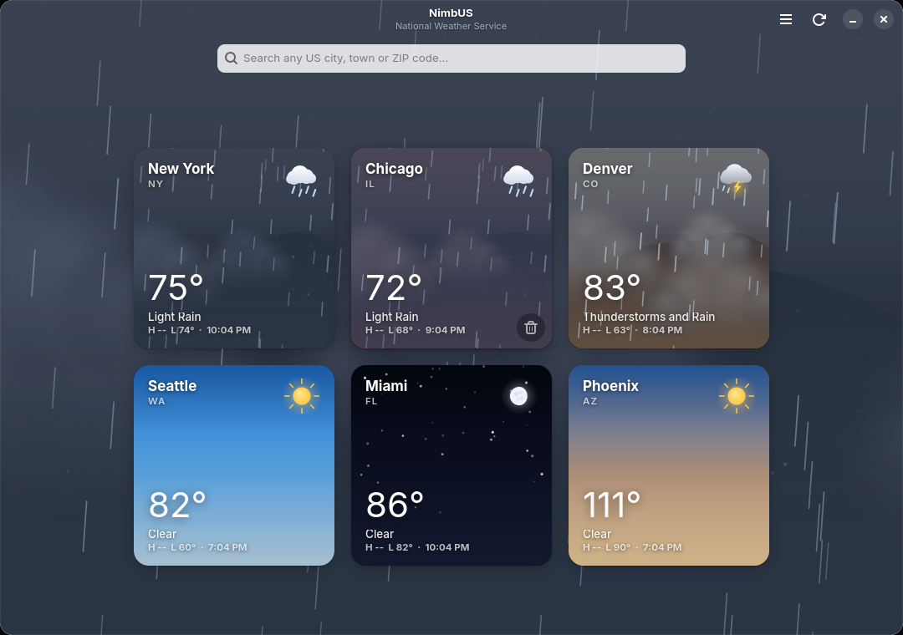
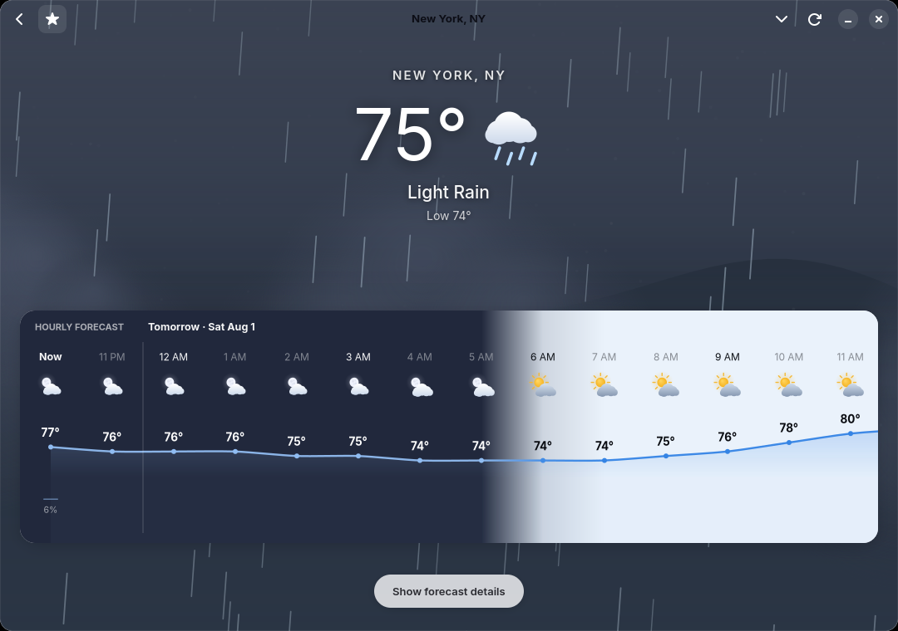
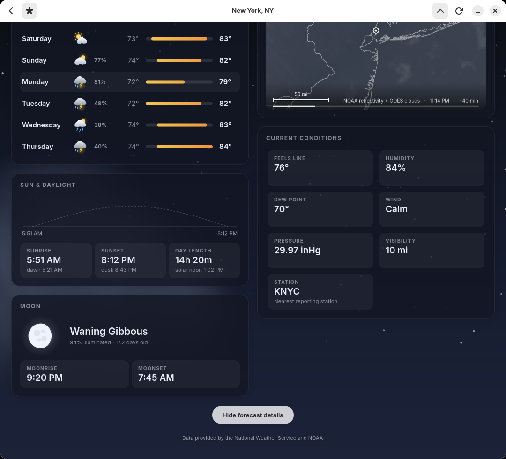

# NimbUS

A weather application for GNOME, built with GTK4 and libadwaita, showing
forecasts, radar and alerts from United States National Weather Service data —
the capitalisation is no accident: NimbUS covers US weather.

NimbUS is an independent project. It is not affiliated with, sponsored by,
approved by, or endorsed by the National Weather Service, NOAA, or any
government agency; they are the source of the (public domain) data only.

Every weather symbol and sky scene is drawn as vector art at runtime, so the
interface renders a live illustration of the actual conditions: the gradient
follows the sun's real altitude, stars appear as twilight deepens, the moon is
shown at its true phase, and rain, snow, fog and lightning animate over
drifting cloud layers.



## Features

**Dashboard.** Every pinned location as a card showing live conditions over its
own sky, with the local time and today's high and low. Cards carrying an active
watch or warning are outlined. Click one to open it.

**Location view.** A simple display first: current conditions over an animated
sky, and a 48-hour forecast drawn as a continuous temperature curve with
per-hour glyphs and precipitation probability. The strip shades from day into
night following the real position of the sun, and every label, glyph and line
takes its colour from the background beneath it so nothing loses contrast
through a twilight. One toggle expands it into the
full report:

- today's and tonight's forecast narrative from the local forecast office
- animated radar with NOAA reflectivity and GOES satellite cloud cover
- a 7-day forecast whose range bars share one temperature scale, so the week
  reads as a single chart
- sunrise, sunset, civil dawn and dusk, day length and solar noon
- moonrise, moonset, and the moon phase drawn at its true illumination
- feels-like, humidity, dew point, wind, pressure, visibility, and the
  reporting station

After dark, the whole report dresses itself to match the night sky.





**Search and favourites.** A search box sits permanently above the grid: look
up any US city, town or ZIP code, then pin it.
Pinned locations persist between runs, can be reordered, and refresh
automatically every 5 minutes.

**Alerts.** Active NWS watches, warnings and advisories appear above the
forecast, coloured by severity, and expand to the full text.

## Installing

### Packages

Every [release](https://github.com/WaltRiceJr/nimbus/releases) carries
ready-made packages:

| File | For | Install with |
| --- | --- | --- |
| `nimbus-weather-*.noarch.rpm` | Fedora and friends | `sudo dnf install ./nimbus-weather-*.noarch.rpm` |
| `nimbus-weather_*_all.deb` | Debian and Ubuntu | `sudo apt install ./nimbus-weather_*_all.deb` |
| `nimbus-weather.flatpak` | any distribution | `flatpak install ./nimbus-weather.flatpak` |
| `nimbus_weather-*.whl` | pip users | `pip install nimbus_weather-*.whl` |

The RPM and deb use your system's GTK stack; the Flatpak bundles the GNOME
runtime and needs nothing else installed. All of them put **NimbUS** in your
application list and a `nimbus-weather` command on your path.

### From source

Requirements: Python 3.11+, GTK 4.10+ and libadwaita 1.4+ with their GObject
introspection data, PyGObject and pycairo.

On Fedora:

```
sudo dnf install python3-gobject gtk4 libadwaita python3-cairo
```

On Debian or Ubuntu:

```
sudo apt install python3-gi python3-gi-cairo gir1.2-gtk-4.0 gir1.2-adw-1
```

Then, from a checkout — run in place, or install into your home directory
(no root needed):

```
python3 -m nimbus     # run without installing
./install.sh          # install launcher, icon and desktop entry to ~/.local
```

### Building the packages yourself

The `packaging/` directory holds everything the release pipeline uses:

```
packaging/nimbus-weather.spec      # RPM spec (Fedora pyproject macros)
packaging/build-rpm.sh             # rpmbuild wrapper; RPMs land in dist/
packaging/build-deb.sh             # stages and builds the binary .deb
packaging/org.nimbus.Weather.yml   # flatpak-builder manifest (GNOME runtime)
packaging/release.sh               # cut a release: bump, commit, tag
```

To cut a release:

```
packaging/release.sh 1.1.0 --push
```

That bumps the version everywhere it lives (`nimbus/__init__.py`, the RPM
spec and its changelog, the AppStream release list), commits, tags `v1.1.0`
and pushes. The tag runs `.github/workflows/release.yml`, which builds the
wheel, sdist, RPM, deb and Flatpak bundle and attaches them all to a GitHub
release. Without `--push` it stops after tagging so you can review first.

## Keyboard shortcuts

| Shortcut | Action |
| --- | --- |
| `Ctrl+F` | Focus the search box |
| `Ctrl+R` or `F5` | Refresh the current view |
| `Ctrl+Q` | Quit |
| `Escape` | Clear the search box |

## Data sources

Forecasts, observations and alerts come from the National Weather Service API
at `api.weather.gov`, which is public domain and requires no API key. It covers
the United States and its territories only. NimbUS consumes these services as
any member of the public may; nothing about the project is affiliated with,
sponsored by, or endorsed by the NWS or NOAA.

Radar reflectivity is the MRMS mosaic from NOAA's GeoServer at
`opengeo.ncep.noaa.gov`; satellite cloud cover is the GOES East/West infrared
composite from NOAA's nowCOAST at `nowcoast.noaa.gov`.

Place-name search uses the Open-Meteo geocoding API, since the NWS API has no
search endpoint of its own. Results are filtered to the United States.

Sun and moon positions are computed locally from the algorithms in Jean Meeus,
*Astronomical Algorithms*; nothing about the sky rendering requires a network
call.

Where the app stores things:

| Path | Contents |
| --- | --- |
| `~/.config/nimbus-weather/favorites.json` | pinned locations |
| `~/.cache/nimbus-weather/` | cached API responses |

## Project layout

```
nimbus/
  astro.py       solar and lunar positions, rise/set, phase
  conditions.py  NWS icon vocabulary -> conditions; the sky colour system
  drawing.py     Cairo primitives and the weather glyph set
  model.py       domain types and unit conversion
  nws.py         API client, geocoding, radar/satellite imagery, caching
  sky.py         the animated sky widget and standalone glyph icons
  store.py       favourites persistence
  ui/            window, dashboard, location page, radar, charts, stylesheet
data/            desktop entry, AppStream metainfo, icons, screenshots
packaging/       RPM spec, deb builder, flatpak manifest
tools/           icon generation and development preview scripts
```

The `tools/` scripts are development aids rather than part of the app:

```
python3 tools/preview_glyphs.py out.png    # contact sheet of every glyph
python3 tools/preview_sky.py out.png       # contact sheet of sky scenes
python3 tools/make_icon.py                 # regenerate the app icon
python3 tools/screenshot.py DIR [step...]  # drive the app and capture it
```

## Licence

GPL-3.0-or-later.
